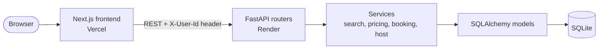
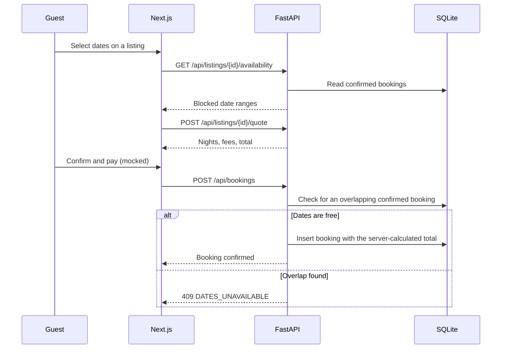
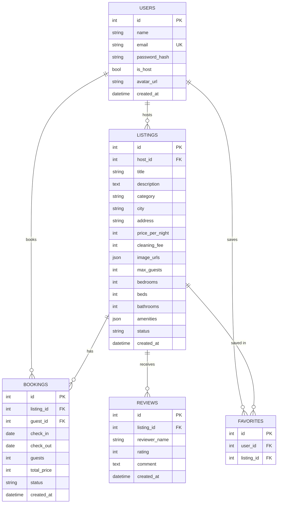

<a id="top"></a>

<div align="center">

# 🏡 Airbnb Clone

**A full-stack stay-booking marketplace: search, book and host, modelled on Airbnb's design and workflow.**

*Built for the Evaratus (formerly Scaler AI Labs) SDE Full-Stack take-home assignment*

<p>
  <a href="https://airbnb-clone-self-delta.vercel.app/"></a>
  <a href="https://airbnb-clone-backend-s4l0.onrender.com/docs"></a>
</p>

<p>
  
  
  
  
  
  
  
  
  
</p>

<p>
  <a href="#-try-it-in-2-minutes"><b>Try it</b></a> ·
  <a href="#-features"><b>Features</b></a> ·
  <a href="#-architecture"><b>Architecture</b></a> ·
  <a href="#-database-design"><b>Database</b></a> ·
  <a href="#-api-overview"><b>API</b></a> ·
  <a href="#-getting-started"><b>Setup</b></a> ·
  <a href="#-known-limitations"><b>Limitations</b></a>
</p>


</div>

> [!NOTE]
> **Cold start:** the backend runs on Render's free tier and sleeps when idle, so the **first request can take 30 to 60 seconds**. Open the [listings endpoint](https://airbnb-clone-backend-s4l0.onrender.com/api/listings) once to wake it, then reload the app. The demo database is rebuilt whenever the backend restarts, so anything you create may disappear.

---

## 📌 At a Glance

| | |
|---|---|
| **What it is** | An Airbnb-style marketplace with a guest side and a host side |
| **Frontend** | Next.js 16 (App Router) · React 19 · TypeScript · Tailwind CSS 4 |
| **Backend** | FastAPI · SQLAlchemy 2.0 · Pydantic v2 · Uvicorn |
| **Database** | SQLite (5 tables), seeded with demo hosts, guests, listings, reviews and bookings |
| **Tests** | 19 pytest tests covering the booking, pricing, search, host and wishlist services |
| **Live app** | https://airbnb-clone-self-delta.vercel.app/ |
| **Live API** | https://airbnb-clone-backend-s4l0.onrender.com |

<details>
<summary><b>📑 Table of contents</b></summary>

1. [Try it in 2 minutes](#-try-it-in-2-minutes)
2. [Features](#-features)
3. [Tech stack](#-tech-stack)
4. [Architecture](#-architecture)
5. [Database design](#-database-design)
6. [API overview](#-api-overview)
7. [Getting started](#-getting-started)
8. [Demo accounts](#-demo-accounts)
9. [Deployment](#-deployment)
10. [Mocked and placeholder features](#-mocked-and-placeholder-features)
11. [Known limitations](#-known-limitations)
12. [Assignment checklist](#-assignment-checklist)
13. [Roadmap](#-roadmap)

</details>

---

## 🧪 Try It in 2 Minutes

Open the [live app](https://airbnb-clone-self-delta.vercel.app/) and follow this path:

| Step | Do this | You should see |
|:---:|---|---|
| 1 | **Search.** Type *Mohali* in the search pill, pick dates and guests, press search | The results narrow to Mohali and the URL carries your search |
| 2 | **Open a listing.** Browse the photo gallery, then select a date range | A live price breakdown: nights × rate + cleaning fee + service fee |
| 3 | **Book it.** Click *Reserve*, fill the mocked card form, confirm | A confirmation page, and the stay under **Trips** |
| 4 | **Test availability.** Avatar menu → **Switch demo user** → *Aditi*, open the same listing | Your booked nights are now unavailable |
| 5 | **Cancel.** Switch back, cancel the trip in **Trips** | The nights open up again for everyone |
| 6 | **Host.** Click **Become a host**, create a listing, edit it, delete it | The host dashboard, listings and reservations |

---

## ✨ Features

<table>
<tr>
<td valign="top" width="50%">

### 🧳 Guest experience
- **Explore** a photo-forward listing grid with card image carousels, ratings and a *Guest favourite* badge
- **Category tabs:** All, Homes, Experiences, Services
- **Search** by location, dates and guests from a floating Airbnb-style pill; search state lives in the URL, so results are shareable
- **Listing detail:** bento photo gallery, amenities, host info, reviews and a sticky booking card
- **Availability calendar** that disables booked nights and rejects ranges that cross one
- **Transparent pricing:** nightly rate × nights + cleaning fee + 14% service fee, calculated on the server
- **Booking flow:** mocked checkout, confirmation page, and **Trips** with Upcoming, Past and Cancelled tabs
- **Cancel a trip** and the dates are freed
- **Wishlist** with an animated heart (optimistic updates) and a Wishlists page
- **Toasts, modals and a login modal** throughout

</td>
<td valign="top" width="50%">

### 🏠 Host experience
- **Guest ⇄ host mode** switch in the header
- **Dashboard:** active listings, upcoming bookings and earnings
- **Listing CRUD:** create, edit and delete, with title, description, photos by URL, price, location, capacity and amenities
- **Draft or published** status per listing
- **Reservations** and a **calendar** view of booked days
- **Safe deletes:** a listing with upcoming bookings is protected (`HAS_UPCOMING_BOOKINGS`)
- **Owner checks:** only a listing's host can edit or delete it (`403` otherwise)

### 🛠️ Engineering
- Layered backend: routers → services → models
- Typed error classes mapped to JSON by one handler
- Server-side price calculation, so the client can never set a price
- Idempotent seed script that runs on startup when the database is empty

</td>
</tr>
</table>

---

## 🧰 Tech Stack

| Layer | Technology |
|---|---|
| **Frontend** | Next.js 16 (App Router), React 19, TypeScript 5, Tailwind CSS 4, lucide-react, sonner (toasts), date-fns |
| **Backend** | Python 3.12, FastAPI 0.115, Pydantic v2, SQLAlchemy 2.0, Uvicorn |
| **Database** | SQLite |
| **Hosting** | Vercel (frontend), Render (backend) |
| **Tooling** | Git and GitHub, pytest, httpx, ESLint |

---

## 🏗️ Architecture



<details open>
<summary><b>Booking request lifecycle</b></summary>



</details>

<details>
<summary><b>📁 Project structure</b></summary>

```
airbnb-clone/
├── backend/
│   ├── main.py            # App entry: CORS, error handler, routers, startup seeding
│   ├── database.py        # Engine, session factory, SQLite foreign-key pragma
│   ├── models.py          # SQLAlchemy models (5 tables)
│   ├── availability.py    # Date-overlap rule and blocked ranges
│   ├── seed.py            # Demo data
│   ├── check_images.py    # Checks that the Unsplash photo URLs still load
│   ├── test_api.py        # 19 service-level tests
│   ├── core/              # auth dependency, exception classes, config
│   ├── routers/           # Thin HTTP layer: auth, listings, bookings, host, wishlist, upload, health
│   ├── services/          # Business logic: auth, listing, booking, host, review, wishlist
│   ├── schemas/           # Pydantic request and response models
│   └── requirements.txt
├── frontend/
│   └── src/
│       ├── app/           # Routes: /, /search, /rooms/[id], /book/[id], /trips, /wishlists, /host/*
│       ├── components/    # Header, footer, search bar, listing card, auth modal, listing form
│       ├── context/       # UserContext, WishlistContext
│       └── lib/           # Typed API client and helpers
└── docs/                  # Screenshots and test notes
```

</details>

---

## 🗄️ Database Design



| Table | Purpose | Constraints and indexes |
|---|---|---|
| `users` | Guests and hosts, told apart by an `is_host` flag | Unique, indexed `email` |
| `listings` | Properties offered by a host | FK `host_id` (cascade); `CHECK` on category (`Homes`, `Experiences`, `Services`), price `>= 0` and status (`draft`, `published`); index `(city, price_per_night)` |
| `bookings` | Reservations | FKs to listing (cascade) and guest; `CHECK (check_out > check_in)`; `CHECK` on status (`confirmed`, `cancelled`); index `(listing_id, check_in, check_out)` |
| `reviews` | Ratings and comments | FK `listing_id` (cascade); `CHECK (rating BETWEEN 1 AND 5)` |
| `favorites` | Wishlist entries | `UNIQUE (user_id, listing_id)`; FKs cascade |

### Design decisions

<details open>
<summary><b>1. Half-open date ranges</b></summary>

A booking blocks `[check_in, check_out)`. Two ranges overlap only if `new_in < old_out AND new_out > old_in`, so one guest can check in the day another checks out. For an existing stay on days 10 to 13:

| New request | Overlap? |
|---|---|
| 13 to 15 (back to back) | No, allowed |
| 12 to 14 (partial) | Yes |
| 8 to 10 (ends the day it starts) | No, allowed |
| 11 to 12 (inside) | Yes |

The same rule is used in `availability.py`, in the search query, and in the calendar on the listing page.

</details>

<details>
<summary><b>2. Price snapshot</b></summary>

`total_price` is saved on the booking, so editing a listing's price later never changes past bookings. The server computes it from the listing, so the client cannot send its own price.

</details>

<details>
<summary><b>3. Derived ratings</b></summary>

Average rating, review count and the *Guest favourite* badge (at least 5 reviews and an average of 4.9 or more) are computed from the reviews table, so they cannot drift out of sync.

</details>

<details>
<summary><b>4. Soft cancellation</b></summary>

Cancelling sets `status = 'cancelled'` instead of deleting the row. Only `confirmed` bookings block dates, so cancelling frees them and keeps the history.

</details>

<details>
<summary><b>5. Enforced foreign keys</b></summary>

SQLite ignores foreign keys by default, so `PRAGMA foreign_keys=ON` runs on every new connection (`database.py`). That is what makes the cascades real.

</details>

<details>
<summary><b>6. JSON columns for photos and amenities</b></summary>

`image_urls` and `amenities` are JSON lists, because they are always loaded with their listing. The trade-off is that they are hard to filter or index; see [Known limitations](#-known-limitations) for the normalised design that would replace them.

</details>

---

## 🔌 API Overview

Interactive documentation: **[/docs](https://airbnb-clone-backend-s4l0.onrender.com/docs)** (Swagger UI).
Auth is mocked: the frontend sends the current demo user's id in an `X-User-Id` header. Application errors raised by the services return `{ "detail": "...", "code": "..." }`.

<details>
<summary><b>View all endpoints</b></summary>

<br />

| Area | Method | Endpoint | Purpose |
|---|---|---|---|
| System | `GET` | `/health` | Health check |
| Auth | `POST` | `/api/auth/login` | Find or create a user by email or phone (demo only) |
| Auth | `GET` | `/api/auth/users` | List demo users for the switch-user menu |
| Auth | `GET` | `/api/auth/me`, `/api/me` | The current user |
| Auth | `PATCH` | `/api/auth/me/mode`, `/api/me/mode` | Switch between guest and host mode |
| Listings | `GET` | `/api/listings` | Search, filter, sort and paginate |
| Listings | `GET` | `/api/listings/{id}` | Detail with host, reviews and ratings |
| Listings | `GET` | `/api/listings/{id}/availability` | Blocked date ranges |
| Listings | `POST` | `/api/listings/{id}/quote` | Price breakdown for a date range |
| Listings | `POST` | `/api/listings` | Create a listing |
| Listings | `PUT` `DELETE` | `/api/listings/{id}` | Update or delete (owner only) |
| Reviews | `GET` `POST` | `/api/listings/{id}/reviews` | Read and post reviews |
| Bookings | `POST` | `/api/bookings` | Create a booking (`409` on conflict) |
| Bookings | `GET` | `/api/bookings/me` | The current user's trips |
| Bookings | `POST` | `/api/bookings/{id}/cancel` | Cancel a booking and free its dates |
| Wishlist | `GET` | `/api/wishlist` | Saved listings |
| Wishlist | `PUT` `DELETE` | `/api/wishlist/{listing_id}` | Save or remove a listing |
| Host | `GET` | `/api/host/dashboard` | Stats and upcoming reservations |
| Host | `GET` | `/api/host/listings` | The host's own listings |
| Uploads | `POST` | `/api/uploads` | Upload an image file |

**Search parameters:** `location`, `category`, `check_in`, `check_out`, `guests`, `min_price`, `max_price`, `bedrooms`, `amenities`, `sort` (`price_asc`, `price_desc`, `rating`), `page`, `page_size`. The response is `{ items, total, page, page_size, has_more }`.

</details>

---

## 🚀 Getting Started

**Prerequisites:** Python 3.12, Node.js 20+, Git.

```bash
git clone https://github.com/Pulkitgoyal10/airbnb-clone.git
cd airbnb-clone
```

<details open>
<summary><b>1️⃣ Backend (terminal 1)</b></summary>

```bash
cd backend
python -m venv venv

# Windows (PowerShell)
venv\Scripts\activate
# macOS / Linux
# source venv/bin/activate

pip install -r requirements.txt
uvicorn main:app --reload --port 8000
```

Tables are created and demo data is seeded automatically on first start. API docs: http://localhost:8000/docs

To wipe and reseed the database manually (this deletes all data): `python seed.py`

</details>

<details open>
<summary><b>2️⃣ Frontend (terminal 2)</b></summary>

```bash
cd frontend
npm install
```

Create `frontend/.env.local`:

```env
NEXT_PUBLIC_API_URL=http://localhost:8000
```

```bash
npm run dev
```

Open http://localhost:3000.

</details>

<details>
<summary><b>🧪 Run the tests</b></summary>

```bash
cd backend
pytest
```

19 tests cover the booking rules (overlap, back-to-back stays, cancelling frees dates), pricing, search filters, host rules and the wishlist.

</details>

<details>
<summary><b>⚙️ Environment variables</b></summary>

| Variable | Used by | Example | Purpose |
|---|---|---|---|
| `NEXT_PUBLIC_API_URL` | Frontend | `http://localhost:8000` | Base URL of the API |
| `DATABASE_URL` | Backend | `sqlite:///./dev.db` | Database location |
| `CORS_ORIGINS` | Backend | `http://localhost:3000,https://airbnb-clone-self-delta.vercel.app` | Comma-separated allowed origins |

</details>

---

## 👥 Demo Accounts

No password is needed. Log in with any email or phone number, or use **Switch demo user** in the avatar menu.

<details open>
<summary><b>Seeded users</b></summary>

<br />

| Role | Name | Email |
|---|---|---|
| Guest | Pulkit | `pulkit@guest.demo` |
| Guest | Aditi | `aditi@guest.demo` |
| Guest | Sameer | `sameer@guest.demo` |
| Host | Gurpreet | `gurpreet@host.demo` |
| Host | Neha | `neha@host.demo` |
| Host | Rajiv | `rajiv@host.demo` |

The seed also creates **13 homes** in Chandigarh, Mohali, Zirakpur and Gurgaon, **104 reviews**, and **17 bookings** (14 in the future so dates are already blocked, 3 in the past so the Past tab has content).

</details>

---

## ☁️ Deployment

| Service | Platform | Configuration |
|---|---|---|
| Frontend | **Vercel** | Root directory `frontend`; environment variable `NEXT_PUBLIC_API_URL` |
| Backend | **Render** (free web service) | Root directory `backend`; build `pip install -r requirements.txt`; start `uvicorn main:app --host 0.0.0.0 --port $PORT`; variables `PYTHON_VERSION`, `DATABASE_URL`, `CORS_ORIGINS` |

Render's free disk is ephemeral, so the app creates the tables and **re-seeds the demo data on every start**. Anything created by hand on the live demo is lost when the backend restarts.

---

## 🎭 Mocked and Placeholder Features

As permitted by the brief:

| Feature | Status |
|---|---|
| Authentication | Mocked. Any email or phone logs in, and the user id travels in an `X-User-Id` header. Guest vs host is a real, saved flag |
| Payments | Mocked checkout; nothing is charged |
| Messaging, identity verification | Placeholders ("Coming soon") |
| Map | Not included |
| Google and Apple sign-in | Placeholder buttons |
| Experiences and Services tabs | The tabs exist, but the demo data contains only Homes |

---

## ⚠️ Known Limitations

Found during a self-audit of this submission. They are listed here so the behaviour is documented, with the planned fix for each.

<details open>
<summary><b>Correctness and security</b></summary>

| Area | Behaviour | Planned fix |
|---|---|---|
| **Concurrent bookings** | The overlap check and the insert are separate steps, so two simultaneous requests for the same dates can both succeed. Reproduced with 12 parallel requests; the sequential rules (overlap, back-to-back, cancel) are covered by the tests | Take SQLite's write lock before the check (`BEGIN IMMEDIATE`), or add a database-level guarantee (a per-night unique table, or a Postgres exclusion constraint) |
| **Authentication** | Mocked. A request without `X-User-Id` is treated as the first guest user | JWT or session cookies with hashed passwords; return `401` when no valid session exists |
| **Roles** | Creating a listing is hidden from guests in the UI but is not checked by the API | Check `is_host` in the create endpoint |
| **Reviews** | The API accepts reviews without a login or a completed stay, and the UI only displays them | Tie reviews to a user and a completed booking, validate the rating range (1 to 5) |
| **Uploads** | The upload endpoint has no file type or size limits, and files are lost when Render restarts. The UI does not use it; photos are added by URL | Validate type and size, require login, store in object storage |
| **Input validation** | Some invalid inputs (for example a malformed date in search, or an unknown category) return `500` instead of `400/422` | Stricter Pydantic constraints and handlers for validation errors |

</details>

<details>
<summary><b>Features and performance</b></summary>

| Area | Behaviour | Planned fix |
|---|---|---|
| **Filters** | The search API supports price, bedroom, amenity and sort parameters, but the UI has no filter controls yet. The amenities filter is known not to match correctly because amenities are stored as a JSON list | Filter modal in the UI; normalise amenities into their own table (or match with `json_each`) |
| **Pagination** | The API paginates (`page`, `page_size`, `has_more`); the UI loads the first page of 40 | Infinite scroll or a Show more button using `has_more` |
| **Experiences and Services** | Tabs exist but no seed data | Seed data and empty states |
| **Query count** | Listing ratings are computed per listing, which adds one query per row | Eager-load reviews or store rating aggregates |
| **Trips** | A stay that has already started appears in neither Upcoming nor Past, and the date logic uses UTC | Add an *In progress* state and compare local dates |
| **Schema** | Photos and amenities are JSON; reviews store a name, not a user | Normalised `amenities`, `listing_photos` tables; `user_id` and `booking_id` on reviews |
| **Migrations** | Tables are created with `create_all` and there is no migration tool | Alembic |

</details>

---

## ✅ Assignment Checklist

| Requirement | Status |
|---|---|
| Home grid with search and category tabs | ✅ |
| Search by location, dates and guests | ✅ |
| Filters (price range, property type, amenities) in the UI | ⏳ API ready, UI pending |
| Pagination or infinite scroll | ⏳ API paginated, UI loads one page |
| Listing detail: gallery, amenities, host, reviews, price breakdown | ✅ |
| Availability calendar with blocked dates | ✅ |
| Booking flow, mocked checkout, My Trips, persistence and date blocking | ✅ |
| Host dashboard with create, edit and delete | ✅ |
| Wishlist, toasts, modals, date pickers | ✅ |
| Seeded users, listings, reviews and bookings | ✅ |
| Next.js (TypeScript) + FastAPI + SQLite, public repo and hosted demo | ✅ |
| README with setup, architecture, schema and API overview | ✅ |
| Bonus: review after a stay, map, dark mode, cloud image upload | ⏳ Not included |

---

## 🗺️ Roadmap

1. Make booking atomic at the database level and add a concurrency test
2. Filter modal, infinite scroll, and seed data for Experiences and Services
3. Review submission after a completed stay
4. Real authentication (JWT) and server-side role checks
5. Interactive map with price pins, and dark mode
6. PostgreSQL, cloud image storage and Alembic migrations

<div align="right"><a href="#top">⬆ Back to top</a></div>

---

<div align="center">

**Built by [Pulkit Goyal](https://github.com/Pulkitgoyal10)**

*An educational clone made for a take-home assignment. Not affiliated with Airbnb, Inc.*

</div>
