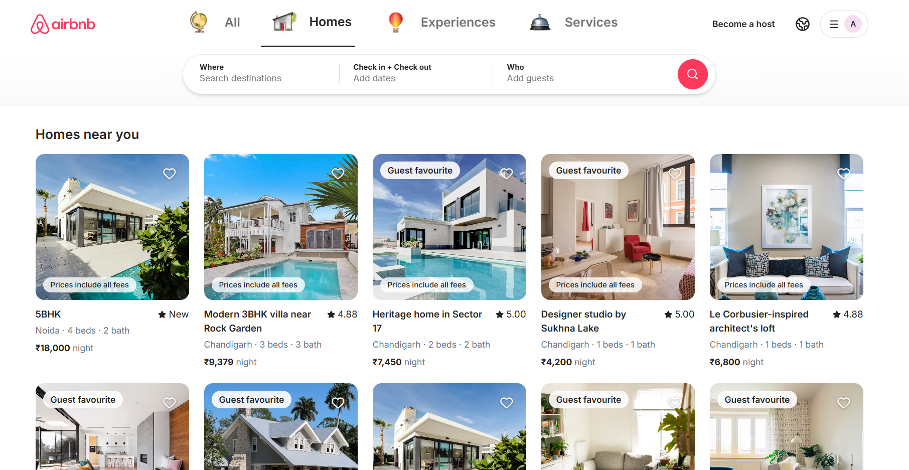
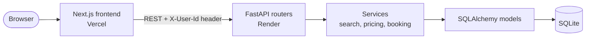
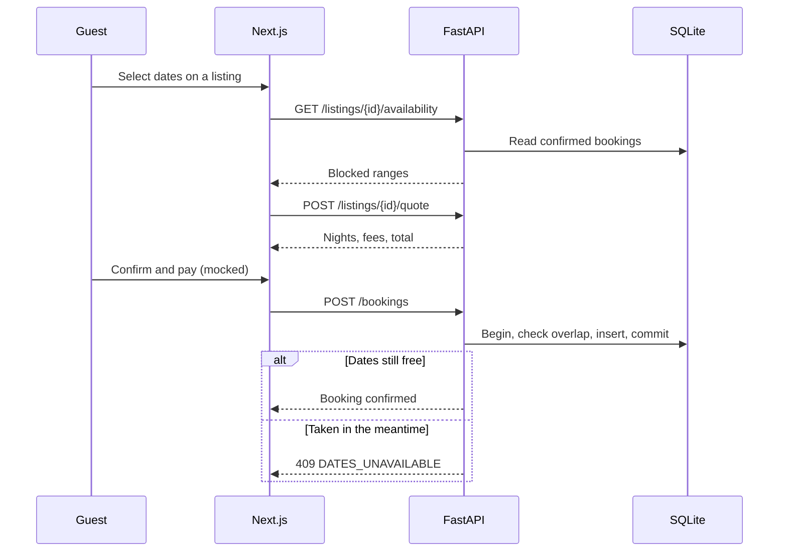
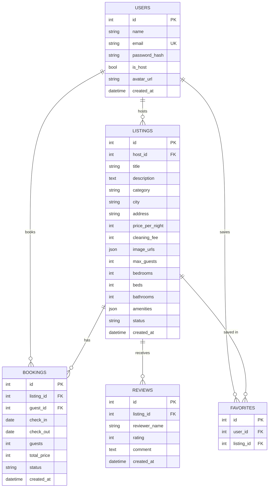

<div align="center">

# Airbnb Clone

**A full-stack marketplace to browse, search, book and host stays, modelled on Airbnb's design and booking workflow.**

*Evaratus (formerly Scaler AI Labs) · SDE Full-Stack take-home assignment*

<p>
  <a href="https://airbnb-clone-self-delta.vercel.app/"></a>
  <a href="https://airbnb-clone-backend-s4l0.onrender.com/docs"></a>
</p>

<p>
  
  
  
  
  
  
  
</p>

<p>
  <a href="#-try-it-in-2-minutes">Try it</a> ·
  <a href="#-features">Features</a> ·
  <a href="#-architecture">Architecture</a> ·
  <a href="#-database-design">Database</a> ·
  <a href="#-engineering-challenges">Challenges</a> ·
  <a href="#-api-overview">API</a> ·
  <a href="#-getting-started">Setup</a>
</p>



</div>

> [!NOTE]
> The backend runs on Render's free tier, which sleeps when idle. **The first request can take 30 to 60 seconds.** Open the [listings endpoint](https://airbnb-clone-backend-s4l0.onrender.com/api/listings) once to wake it, then reload the app. Demo data is rebuilt whenever the backend restarts.

---

## 📌 At a Glance

| | |
|---|---|
| **What it is** | An Airbnb-style marketplace with guest and host experiences |
| **Frontend** | Next.js (App Router) · TypeScript · Tailwind CSS |
| **Backend** | FastAPI · SQLAlchemy 2.0 · Pydantic v2 |
| **Database** | SQLite, seeded with demo hosts, guests, listings, reviews and bookings |
| **Core guarantee** | A booked date can never be double-booked |
| **Live app** | https://airbnb-clone-self-delta.vercel.app/ |
| **Live API** | https://airbnb-clone-backend-s4l0.onrender.com |

---

## 🧪 Try It in 2 Minutes

Open the [live app](https://airbnb-clone-self-delta.vercel.app/) and follow this path to see the core logic working:

1. **Search.** Type a city such as *Mohali*, pick dates and guests, and press search. Results filter and the URL updates.
2. **Open a listing.** Browse the gallery, check amenities and reviews, then select a date range. The price breakdown updates live.
3. **Book it.** Click *Reserve*, fill the mocked card form and confirm. You land on a confirmation page, and the stay appears under **Trips**.
4. **See availability blocking.** Open the avatar menu, choose **Switch demo user** (for example *Aditi*), and open the same listing. Your dates are now unavailable.
5. **Cancel.** Switch back, cancel the trip, and the dates open up again for everyone.
6. **Host a place.** Click **Become a host**, create a listing, edit it, then delete it.

---

## ✨ Features

### 🧳 Guest experience
- **Explore grid** with category tabs, card photo carousels, rating badges and a *Guest favourite* label.
- **Search** by location, date range and guests from a floating search pill. Search state lives in the URL, so results are shareable and the back button works.
- **Listing detail** with a bento photo gallery, amenities, host info, a reviews section and a sticky booking card.
- **Availability calendar** that disables booked days and rejects ranges that cross one.
- **Transparent pricing:** nightly rate × nights + cleaning fee + service fee.
- **Booking flow** with a mocked checkout, a confirmation page and **Trips** (Upcoming, Past, Cancelled).
- **Wishlist** with an animated heart, saved per user.
- **Toast feedback** for key actions.

### 🏠 Host experience
- **Guest ⇄ host mode** toggle in the header.
- **Dashboard** with active listings, upcoming bookings and earnings.
- **Full listing CRUD:** title, description, photos by URL, price, location, guests, rooms and amenities.
- **Reservations and calendar** views for the host's listings.
- **Safe deletion:** a listing with upcoming bookings cannot be removed (`HAS_UPCOMING_BOOKINGS`).

---

## 🧰 Tech Stack

| Layer | Technology |
|---|---|
| **Frontend** | Next.js, React, TypeScript, Tailwind CSS, shadcn/ui, lucide-react, react-day-picker, sonner |
| **Backend** | Python 3.12, FastAPI, Pydantic v2, SQLAlchemy 2.0, Uvicorn |
| **Database** | SQLite |
| **Hosting** | Vercel (frontend), Render (backend) |
| **Tooling** | Git, GitHub, pytest, httpx |

---

## 🏗️ Architecture



**Booking request lifecycle**



### Project structure

```
airbnb-clone/
├── backend/
│   ├── main.py            # App entry: CORS, routers, startup seeding
│   ├── database.py        # Engine, session, SQLite foreign-key pragma
│   ├── models.py          # SQLAlchemy models
│   ├── availability.py    # Date-overlap rule and blocked ranges
│   ├── seed.py            # Demo data
│   ├── routers/           # Thin HTTP layer
│   ├── services/          # Business logic: pricing, booking, search
│   ├── schemas/           # Pydantic request and response models
│   └── requirements.txt
├── frontend/
│   └── src/
│       ├── app/           # Routes: /, /search, /rooms/[id], /book, /trips, /host
│       ├── components/    # layout, search, listing, booking, host, auth, ui
│       ├── context/       # User and wishlist providers
│       └── lib/           # Typed API client and helpers
└── docs/                  # Screenshots and test notes
```

---

## 🗄️ Database Design



| Table | Purpose | Constraints and indexes |
|---|---|---|
| `users` | Guests and hosts, distinguished by `is_host` | Unique `email` |
| `listings` | Properties offered by a host | FK `host_id` (cascade); `CHECK` on category, price, status; index `(city, price_per_night)` |
| `bookings` | Reservations | FKs to listing and guest; `CHECK (check_out > check_in)`; index `(listing_id, check_in, check_out)` |
| `reviews` | Ratings and comments | FK `listing_id`; `CHECK (rating BETWEEN 1 AND 5)` |
| `favorites` | Wishlist entries | `UNIQUE (user_id, listing_id)` |

**Design decisions**

1. **Half-open date ranges.** A booking blocks `[check_in, check_out)`. Two stays overlap only if `new_in < old_out AND new_out > old_in`, so one guest can check in the day another checks out.
2. **Atomic booking.** The conflict check and the insert run in one transaction, so two simultaneous requests cannot both succeed.
3. **Price snapshot.** `total_price` is saved at booking time, so editing a listing never rewrites past totals.
4. **Derived ratings.** Average rating, review count and the *Guest favourite* badge are computed from reviews, so they cannot drift out of sync.
5. **Soft cancellation.** Bookings are marked `cancelled`, not deleted. Only `confirmed` bookings block dates, so cancelling frees them and keeps history.
6. **Enforced foreign keys.** SQLite has them off by default, so `PRAGMA foreign_keys=ON` runs on every connection.
7. **JSON columns** for `image_urls` and `amenities`, which are always read with their listing and never queried alone.

---

## 🧩 Engineering Challenges

| Challenge | How it was solved |
|---|---|
| **Double bookings.** Two guests could pick the same dates at the same moment. | Overlap check and insert happen in one transaction; the second request gets `409 DATES_UNAVAILABLE`, which the UI turns into a toast and a *Choose new dates* prompt. |
| **Back-to-back stays.** A strict date comparison would reject a check-in on another guest's check-out day. | Half-open `[in, out)` ranges, with the same rule in the SQL query and the calendar. |
| **Search with dates.** Listings with a conflicting booking must disappear. | The availability rule is applied inside the search query. |
| **Free-tier hosting.** Render's disk is ephemeral, so the SQLite file resets on every restart. | The app creates tables and seeds demo data on startup when the database is empty. |
| **CORS between Vercel and Render.** The browser blocks cross-origin calls unless the backend allows the frontend's origin. | Allowed origins come from the `CORS_ORIGINS` environment variable and are set to the production domain. |
| **Mocked auth with real roles.** The brief allows simplified auth but needs guest vs host. | An `X-User-Id` header plus a persisted `is_host` flag. Owner checks on host endpoints return `403`. |
| **Wishlist feel.** A heart that waits for the server feels slow. | Optimistic UI updates, rolled back if the request fails. |

---

## 🔌 API Overview

Interactive documentation: **[/docs](https://airbnb-clone-backend-s4l0.onrender.com/docs)**. Authentication is mocked through an `X-User-Id` header, and errors share the shape `{ "detail": "...", "code": "..." }`.

<details>
<summary><b>View all endpoints</b></summary>

<br />

| Area | Method | Endpoint | Purpose |
|---|---|---|---|
| Auth | `POST` | `/api/auth/login` | Find or create a user by email or phone (demo only) |
| Auth | `GET` | `/api/auth/users` | Demo users for the switch-user menu |
| Auth | `PATCH` | `/api/me/mode` | Toggle guest ⇄ host mode |
| Listings | `GET` | `/api/listings` | Search and paginate |
| Listings | `GET` | `/api/listings/{id}` | Detail with host, reviews, ratings |
| Listings | `GET` | `/api/listings/{id}/availability` | Blocked date ranges |
| Listings | `POST` | `/api/listings/{id}/quote` | Price breakdown for a date range |
| Reviews | `GET` `POST` | `/api/listings/{id}/reviews` | Read and write reviews |
| Bookings | `POST` | `/api/bookings` | Create a booking (`409` on conflict) |
| Bookings | `GET` | `/api/bookings/me` | The current user's trips |
| Bookings | `POST` | `/api/bookings/{id}/cancel` | Cancel and free the dates |
| Wishlist | `GET` | `/api/wishlist` | Saved listings |
| Wishlist | `PUT` `DELETE` | `/api/wishlist/{listing_id}` | Save or remove a listing |
| Host | `GET` | `/api/host/dashboard` | Stats and reservations |
| Host | `GET` | `/api/host/listings` | The host's own listings |
| Host | `POST` `PUT` `DELETE` | `/api/listings`, `/api/listings/{id}` | Create, update, delete (owner only) |
| System | `GET` | `/health` | Health check |

**Search parameters:** `location`, `category`, `check_in`, `check_out`, `guests`, `page`, `page_size`. The API also accepts `min_price`, `max_price`, `bedrooms`, `amenities` and `sort`; the filter controls for these are not in the UI yet.

</details>

---

## 🚀 Getting Started

**Prerequisites:** Python 3.12, Node.js 20+, Git.

```bash
git clone https://github.com/Pulkitgoyal10/airbnb-clone.git
cd airbnb-clone
```

### Backend (terminal 1)

```bash
cd backend
python -m venv venv

# Windows (PowerShell)
venv\Scripts\activate
# macOS / Linux: source venv/bin/activate

pip install -r requirements.txt
uvicorn main:app --reload --port 8000
```

Tables are created and demo data is seeded on first start. Run `python seed.py` to wipe and reseed. API docs: http://localhost:8000/docs

### Frontend (terminal 2)

```bash
cd frontend
npm install
```

Create `frontend/.env.local`:

```env
NEXT_PUBLIC_API_URL=http://localhost:8000
```

```bash
npm run dev
```

Open http://localhost:3000.

### Environment variables

| Variable | Used by | Example | Purpose |
|---|---|---|---|
| `NEXT_PUBLIC_API_URL` | Frontend | `http://localhost:8000` | API base URL |
| `DATABASE_URL` | Backend | `sqlite:///./dev.db` | Database location |
| `CORS_ORIGINS` | Backend | `http://localhost:3000,https://airbnb-clone-self-delta.vercel.app` | Comma-separated allowed origins |

### Tests

```bash
cd backend
pytest
```

---

## 👥 Demo Accounts

No password is needed. Log in with any email or phone, or use **Switch demo user** in the avatar menu.

<details>
<summary><b>Seeded users</b></summary>

<br />

| Role | Name | Email |
|---|---|---|
| Guest | Pulkit | `pulkit@guest.demo` |
| Guest | Aditi | `aditi@guest.demo` |
| Guest | Sameer | `sameer@guest.demo` |
| Host | Gurpreet | `gurpreet@host.demo` |
| Host | Neha | `neha@host.demo` |
| Host | Rajiv | `rajiv@host.demo` |

</details>

---

## ☁️ Deployment

| Service | Platform | Configuration |
|---|---|---|
| Frontend | **Vercel** | Root directory `frontend`; env `NEXT_PUBLIC_API_URL` |
| Backend | **Render** (free web service) | Root directory `backend`; build `pip install -r requirements.txt`; start `uvicorn main:app --host 0.0.0.0 --port $PORT` |

---

## 🎭 Mocked and Placeholder Features

As permitted by the brief:

| Feature | Status |
|---|---|
| Authentication | Mocked. Any email or phone logs in; the user id travels in `X-User-Id`. Guest vs host is real and persisted. |
| Payments | Mocked checkout, no real processing |
| Messaging, identity verification | Placeholders ("Coming soon") |
| Map | Not included; the location section is a placeholder |
| Experiences and Services tabs | Limited placeholder content |
| Google and Apple sign-in | Placeholder buttons |

---

## 🧠 Assumptions and Limitations

- Prices are in **INR (₹)**, and the service fee is a percentage of the stay subtotal.
- Guests cannot exceed a listing's `max_guests`, and stays have a maximum length.
- Photos are Unsplash URLs, or added by URL when hosting.
- SQLite suits a demo. In production I would use PostgreSQL, real authentication (JWT sessions, hashed passwords, OAuth), cloud image storage and rate limiting.
- The first load after idle is slow because of the free-tier cold start.

**Not included in this version**

- Filter controls for price range, property type and amenities (the API accepts some of these parameters)
- A UI for submitting a review after a stay (reviews are displayed; the endpoint exists)
- An interactive or static map
- Dark mode
- Full content for the Experiences and Services tabs

---

## ✅ Assignment Checklist

| Requirement | Status |
|---|---|
| Home grid with search, category tabs and paginated API | ✅ |
| Advanced filters (price, property type, amenities) | ⏳ Not included |
| Listing detail: gallery, amenities, host, reviews, price breakdown | ✅ |
| Availability calendar with blocked dates | ✅ |
| Booking flow, My Trips, persistence and date blocking | ✅ |
| Host dashboard with create, edit, delete | ✅ |
| Wishlist, toasts, modals, date pickers | ✅ |
| Seeded users, listings, reviews and bookings | ✅ |
| Next.js (TypeScript) + FastAPI + SQLite | ✅ |
| Dark mode, map, cloud image upload (bonus) | ⏳ Not included |

---

## 🗺️ Roadmap

1. Filter modal for price range, property type and amenities
2. Review submission after a completed stay
3. Interactive map with price pins
4. Dark mode
5. Real authentication (JWT and OAuth)
6. PostgreSQL and cloud image storage
7. Host and guest messaging

---

<div align="center">

**Built by [Pulkit Goyal](https://github.com/Pulkitgoyal10)**

*An educational clone made for a take-home assignment. Not affiliated with Airbnb, Inc.*

</div>
